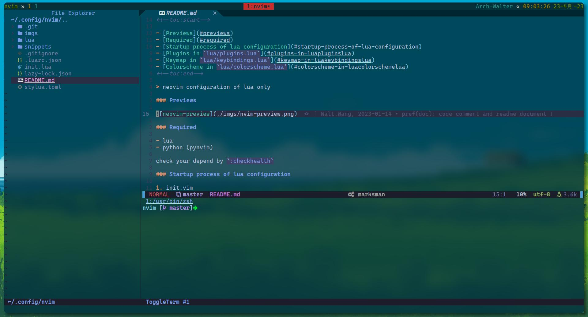

<!--toc:start-->
- [Previews](#previews)
- [Required](#required)
- [Startup process of lua configuration](#startup-process-of-lua-configuration)
- [Plugins be Loaded in `lua/plugins/init.lua` by `lazy.nvim`](#plugins-be-loaded-in-luapluginsinitlua-by-lazynvim)
- [Plugin configuration in `lua/plugins/config/`](#plugin-configuration-in-luapluginsconfig)
- [Custom Keymap in `lua/keybindings.lua`](#custom-keymap-in-luakeybindingslua)
<!--toc:end-->

> neovim configuration of lua only

### Previews



### Required

- lua
- python (pynvim)

check your depend by `:checkhealth`

### Startup process of lua configuration

```
├── init.lua    // startup
├── lua
│   ├── environment.lua     // vim setting
│   ├── keybindings.lua     // key mapping
│   ├── launcher.lua        // task manage
│   ├── plugins
│   │   ├── configs   // plugins config
│   │   ├── fcitx.lua // IM manage
│   │   └── init.lua  // lazy.nvim startup
│   └── util.lua
└─── snippets // vsnip
```

1. `init.lua`

> Require Load the configuration files of each plug-in function

```lua
-- vim environment (some variable)
require('environment')

-- import packer-plugins
require('plugins')

-- keymap binding
require('keybindings').Load_Keys('Common')

-- input method
require('plugins.fcitx')
```

### Plugins be Loaded in `lua/plugins/init.lua` by `lazy.nvim`

```lua
local lazypath = vim.fn.stdpath('data') .. '/lazy/lazy.nvim'
if not vim.loop.fs_stat(lazypath) then
  vim.fn.system({
    'git',
    'clone',
    '--filter=blob:none',
    'https://github.com/folke/lazy.nvim.git',
    '--branch=stable', -- latest stable release
    lazypath,
  })
end
vim.opt.rtp:prepend(lazypath)

require('lazy').setup({
  -- base or lib
  'nvim-lua/plenary.nvim',
  { 'MunifTanjim/nui.nvim', lazy = true },

  -- develop
  'wakatime/vim-wakatime',

  -- gui
  {
    'rcarriga/nvim-notify',
    opts = function()
      return require('plugins.configs.notify')
    end,
    config = function(_, opts)
      local notify = require('notify')
      notify.setup(opts)
      vim.notify = notify
    end,
  },
  ......
})
```

### Plugin configuration in `lua/plugins/config/`
if you want to custom yourself plugin, create a lua configuration in `lua/plugins/config/` and add property `opts` and `config` for your custom plugin in `lua/plugins/init.lua`.

### Custom Keymap in `lua/keybindings.lua`

```lua
-- set leader key
vim.g.mapleader = " "
vim.g.maplocalleader = " "

M.Translator = {
  -- all mode
  [""] = {...}
  -- normal mode
  n = {
    ['<leader>tw'] = '<Plug>TranslateW',
    ['<leader>tr'] = '<Plug>TranslateR --target_lang=en',
  },
  -- visual mode
  v = {
    ['<leader>tw'] = '<Plug>TranslateWV',
    ['<leader>tr'] = '<Plug>TranslateRV --target_lang=en',
  },
}
```
