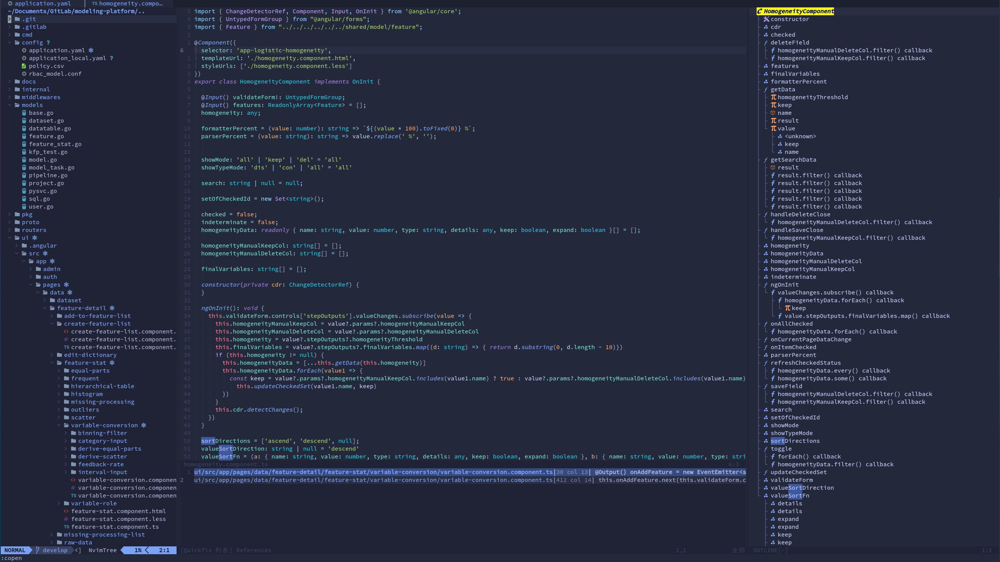
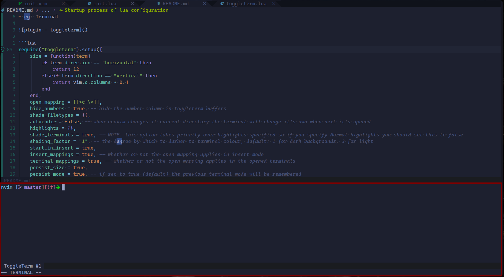

<!--toc:start-->

- [Previews](#previews)
- [Required](#required)
- [Startup process of lua configuration](#startup-process-of-lua-configuration)
- [Plugins in `lua/plugins.lua`](#plugins-in-luapluginslua)
- [Keymap in `lua/keybindings.lua`](#keymap-in-luakeybindingslua)
- [Colorscheme in `lua/colorscheme.lua`](#colorscheme-in-luacolorschemelua)
<!--toc:end-->

> neovim configuration of lua only

### Previews



### Required

- lua
- python (pynvim)

check your depend by `:checkhealth`

### Startup process of lua configuration

1. init.vim

```vimscript
" load lua/init.lua
lua require('init')
```

2. init.lua

> Require Load the configuration files of each plug-in function

```lua
-- 导入packer-plugins
require("plugins")

-- 加速启动
require("impatient").enable_profile()

-- 导入快捷键绑定
require("keybindings")

-- colorscheme
require("colorscheme")

require("env")

-- lsp
require("lsp/lsp")
require("lsp/diagnostic")
require("lsp/nvim-cmp")
...
require("lsp/formatter")

-- config
require("plugin-config/dashboard-nvim")
require("plugin-config/bufferline")
require("plugin-config/lualine")
require("plugin-config/toggleterm")
...
require("plugin-config/nvim-tree")
require("plugin-config/nvim-treesitter")
require("plugin-config/comment")

-- 16进制颜色显示
require("colorizer").setup()
require("hop").setup({ keys = "etovxqpdygfblzhckisuran" })
```

- eg: Terminal



configuration

```lua
require("toggleterm").setup({
	size = function(term)
		if term.direction == "horizontal" then
			return 12
		elseif term.direction == "vertical" then
			return vim.o.columns * 0.4
		end
	end,
	open_mapping = [[<c-\>]],
	hide_numbers = true, -- hide the number column in toggleterm buffers
	shade_filetypes = {},
	autochdir = false, -- when neovim changes it current directory the terminal will change it's own when next it's opened
	highlights = {},
	shade_terminals = true, -- NOTE: this option takes priority over highlights specified so if you specify Normal highlights you should set this to false
	shading_factor = "1", -- the degree by which to darken to terminal colour, default: 1 for dark backgrounds, 3 for light
	start_in_insert = true,
	insert_mappings = true, -- whether or not the open mapping applies in insert mode
	terminal_mappings = true, -- whether or not the open mapping applies in the opened terminals
	persist_size = true,
	persist_mode = true, -- if set to true (default) the previous terminal mode will be remembered
	direction = "horizontal", -- vertical / horizontal / tab / float
	close_on_exit = true, -- close the terminal window when the process exits
	shell = vim.o.shell, -- change the default shell
	auto_scroll = true, -- automatically scroll to the bottom on terminal output
	float_opts = {
		border = "single", -- single / double / shadow / curved
		winblend = 3,
	},
	winbar = {
		enabled = false,
	},
})
```

### Plugins in `lua/plugins.lua`

```lua
return require('packer').startup(function()
    use '...package name'
end)
```

### Keymap in `lua/keybindings.lua`

```lua
-- set leader key
vim.g.mapleader = " "
vim.g.maplocalleader = " "

local map = vim.api.nvim_set_keymap
local opt = { noremap = true, silent = true }

-- translator
map('n','<leader>tw',"<cmd>TranslateW<CR>",opt)
map('v','<leader>tw',"<Plug>TranslateWV",opt)
map('v','<leader>tr',"<Plug>TranslateRV",opt)
```

### Colorscheme in `lua/colorscheme.lua`

it use tokyonight theme. if you want to use custom theme, change `colorscheme tokyonight`.

```lua
-- Load the colorscheme
vim.cmd([[colorscheme tokyonight]])

-- configure tokyonight
require("tokyonight").setup({...})
```
